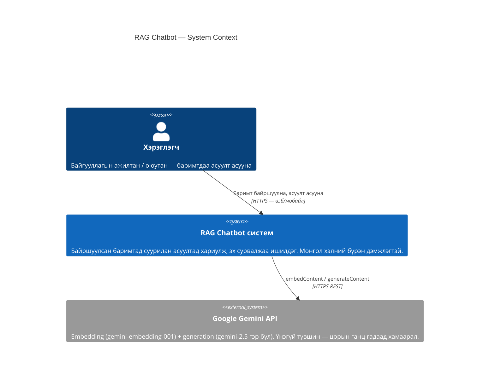
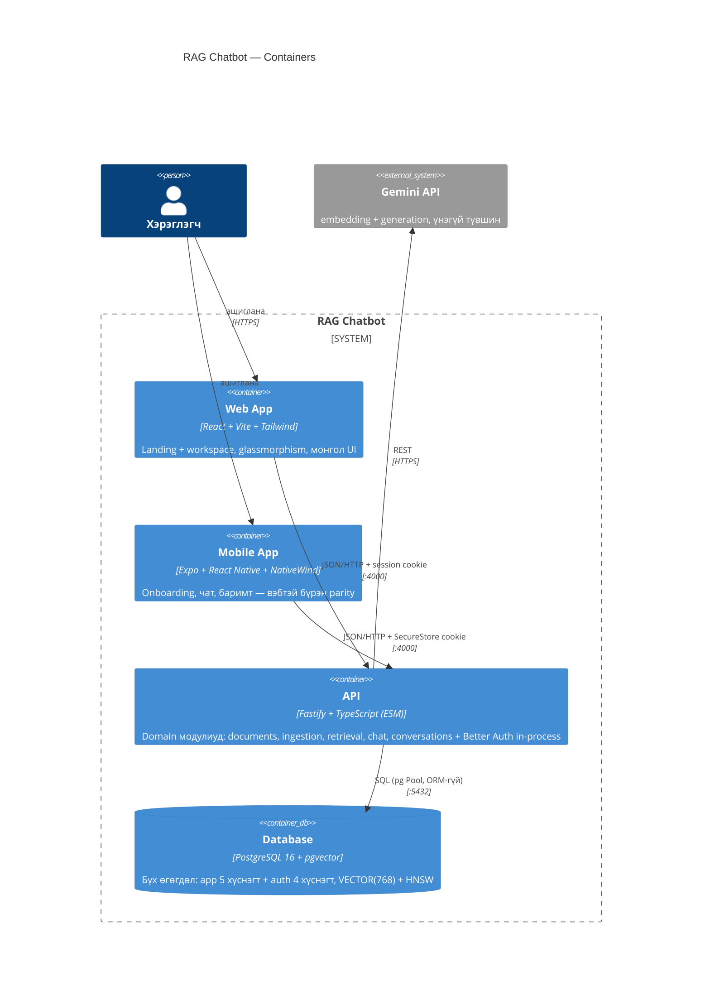

# C4 Model

C4-ийн эхний хоёр түвшин. Түвшин 3 (Component)-ийг тусад нь зурахгүй — серверийн модулиудын задаргаа `report/figures/architecture.png` болон CLAUDE.md-ийн модулийн хүснэгтэд аль хэдийн бий.

## Level 1 — System Context

## Level 2 — Containers

> Тайлангийн Зураг 4.1 (`architecture.png`) энэ түвшнийг илүү дэлгэрэнгүй (модулиудтай нь) харуулдаг тул энэ хувилбар зөвхөн docs-д байна — давхардуулахгүй.

