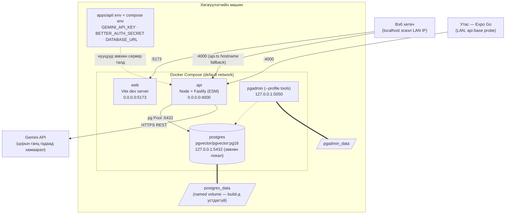
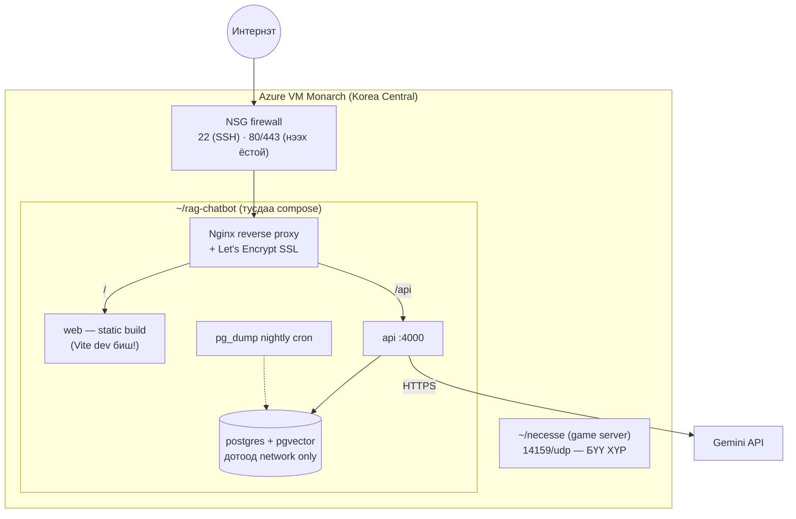

# Deployment Diagrams

## 1. Одоогийн орчин — Docker Compose (локал / LAN dev)

Код: `docker-compose.yml`. Нэг командаар бүрэн стек: `pnpm docker:up`.

- `postgres` зөвхөн `127.0.0.1`-д холбогдсон — LAN-аас сан руу шууд хандах боломжгүй.
- Web контейнерт API хаяг тохируулаагүй — клиент `window.location.hostname:4000` fallback ашигладаг тул LAN-аас нээхэд автоматаар зөв хост руу очно (ERR-016/017).
- API асахдаа `infra/postgres/migrations/`-ийн хэрэгжээгүй файлуудыг автоматаар хэрэгжүүлнэ.

## 2. Зорилтот орчин — Azure VM "Monarch" (Priority 5, төлөвлөгдсөн)

VM: Standard D4as v5, Ubuntu 24.04, static IP 40.82.138.44. **Game сервертэй хуваалцдаг** — RAG зөвхөн `~/rag-chatbot/` дотор, өөрийн compose-той.

- Production дүрмүүд: deploy скрипт бүр `cd ~/rag-chatbot` хийж эхэлнэ; **хэзээ ч** `docker system prune -a` / `docker compose down -v` хийхгүй; CORS/trustedOrigins-ыг reflect-any-origin-оос бодит домэйн болгож чангална.
- Vercel дээр `apps/web`-ийг тусад нь байршуулах хувилбар нээлттэй (тэгвэл VM дээр зөвхөн API үлдэнэ).
