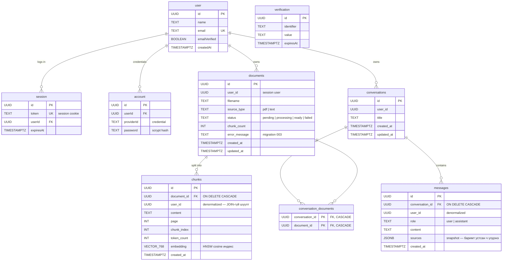

# Database ER Diagram

Бүх өгөгдөл нэг локал PostgreSQL (pgvector/pgvector:pg16) санд: аппликейшны 5 хүснэгт (`infra/postgres/init/001_schema.sql` + migrations) ба Better Auth-ийн 4 хүснэгт (`002_auth.sql`). Дэлгэрэнгүй SQL: [DB_SCHEMA.md](../DB_SCHEMA.md).

## Design notes

- **`VECTOR(768)`** нь `gemini-embedding-001`-ийн `outputDimensionality: 768`-тай заавал тэнцүү — өгөгдөл орсны дараа өөрчлөх боломжгүй.
- **HNSW индекс** (`vector_cosine_ops`) — `match_chunks` функцийн ойролцоо хайлтыг ~O(log n) болгодог.
- **`user_id` denormalization** — `chunks`/`messages` дээр шууд хадгалснаар `match_chunks` JOIN-гүйгээр хэрэглэгчээр шүүдэг (аюулгүй байдлын шүүлт хамгийн гүн давхаргад).
- **`sources` JSONB snapshot** — хариулт үүссэн агшны эх сурвалжууд; эх баримт устсан ч түүхэн мессежийн ишлэл хадгалагдана.
- **Auth хүснэгтүүд** — Better Auth өөрөө удирдана (app кодоос бичихгүй); багана нэрс camelCase тул SQL-д заавал хашилттай (`"userId"`). ID-ууд `advanced.database.generateId`-ээр UUID тул app хүснэгтүүдийн `user_id UUID`-тай шууд нийцнэ.
- **Schema өөрчлөлт** — `init/` хөлдөөсөн; бүх өөрчлөлт `infra/postgres/migrations/NNN_*.sql`, API асахад автоматаар хэрэгжинэ (`schema_migrations`-д бүртгэнэ).
