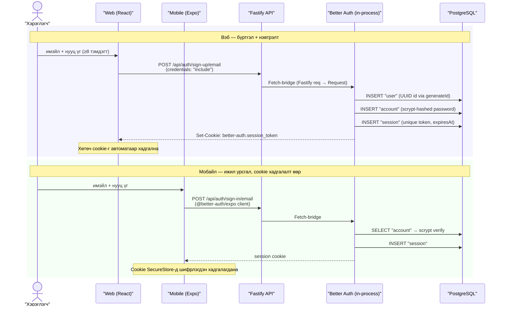
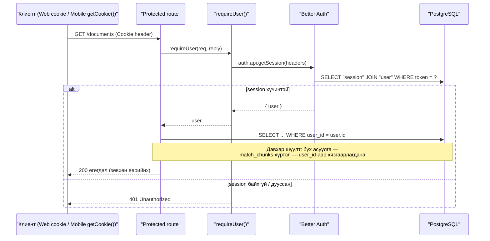

# Auth Flow Sequence

Better Auth нь тусдаа үйлчилгээ биш — API процессын дотор ажиллаж, аппликейшнтэй нэг pg Pool хуваалцана. Код: `apps/api/src/shared/auth.ts` (betterAuth instance), `index.ts` (Fastify → Fetch bridge, `/api/auth/*`), `shared/session.ts` (`requireUser()`).

## Бүртгэл / нэвтрэлт

## Хамгаалагдсан хүсэлт (401 guard + user_id шүүлт)

## Тэмдэглэл

- Нээлттэй route зөвхөн 3: `/health`, `/config`, `/api/auth/*` — бусад бүх route `requireUser()`-ээр эхэлнэ.
- Better Auth ID-ууд `advanced.database.generateId`-ээр UUID үүсдэг тул app хүснэгтүүдийн `user_id UUID`-тай шууд нийцнэ.
- Auth хүснэгтүүдийн багана нэрс camelCase — SQL-д заавал хашилттай (`"userId"`, `"expiresAt"`).
- Мобайл дээр `@better-auth/expo` нь `expo-secure-store`/`expo-network`/`expo-web-browser` peer deps шаарддаг — устгавал `expo export` эвдэрнэ (ERR-025).
