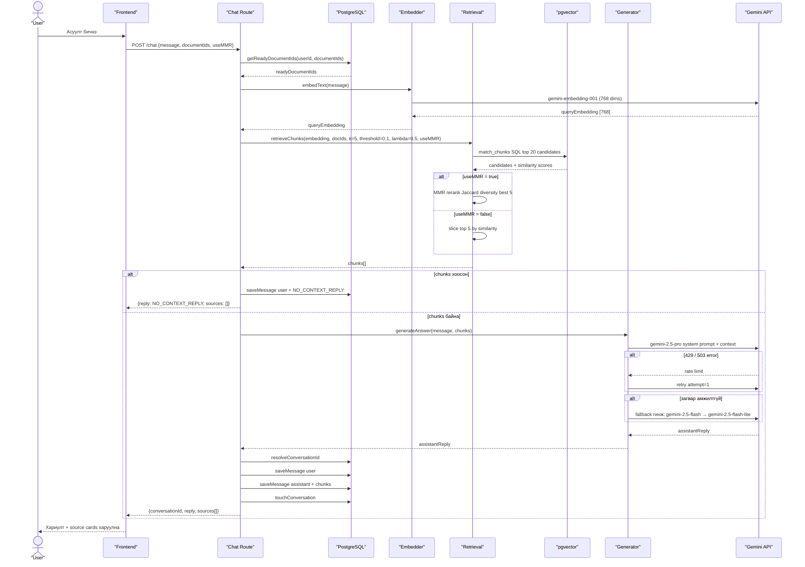

# Sequence Diagrams

## Chat Workflow

Хэрэглэгч асуулт илгээснээс эхлээд хариулт хүлээн авах хүртэлх бүрэн RAG workflow.

```mermaid
sequenceDiagram
    actor User as "User"
    participant UI as "Frontend"
    participant API as "Chat Route"
    participant DB as "PostgreSQL"
    participant Emb as "Embedder"
    participant Ret as "Retrieval"
    participant PGV as "pgvector"
participant Gen as "Generator"
    participant Gem as "Gemini API"

    User->>UI: Асуулт бичнэ
    UI->>API: POST /chat {message, documentIds, useMMR}

    API->>DB: getReadyDocumentIds(userId, documentIds)
    DB-->>API: readyDocumentIds

    API->>Emb: embedText(message)
    Emb->>Gem: gemini-embedding-001 (768 dims)
    Gem-->>Emb: queryEmbedding [768]
    Emb-->>API: queryEmbedding

    API->>Ret: retrieveChunks(embedding, docIds, k=5, threshold=0.1, lambda=0.5, useMMR)
    Ret->>PGV: match_chunks SQL top 20 candidates
    PGV-->>Ret: candidates + similarity scores

    alt useMMR = true
        Ret->>Ret: MMR rerank Jaccard diversity best 5
    else useMMR = false
        Ret->>Ret: slice top 5 by similarity
    end

    Ret-->>API: chunks[]

    alt chunks хоосон
        API->>DB: saveMessage user + NO_CONTEXT_REPLY
        API-->>UI: {reply: NO_CONTEXT_REPLY, sources: []}
    else chunks байна
        API->>Gen: generateAnswer(message, chunks)
        Gen->>Gem: gemini-2.5-pro system prompt + context

        alt 429 / 503 error
            Gem-->>Gen: rate limit
            Gen->>Gem: retry attempt=1
        end

        alt загвар амжилтгүй
            Gen->>Gem: fallback гинж: gemini-2.5-flash → gemini-2.5-flash-lite
        end

        Gem-->>Gen: assistantReply
        Gen-->>API: assistantReply

        API->>DB: resolveConversationId
        API->>DB: saveMessage user
        API->>DB: saveMessage assistant + chunks
        API->>DB: touchConversation

        API-->>UI: {conversationId, reply, sources[]}
    end

    UI-->>User: Хариулт + source cards харуулна
```