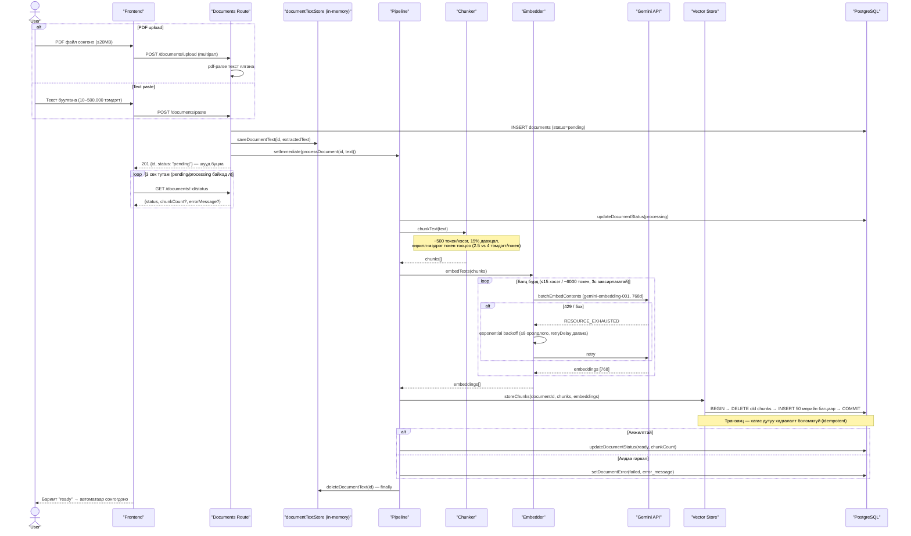

# Ingestion Pipeline Sequence

Баримт оруулснаас (PDF upload / текст paste) эхлээд `ready` болтол хүрэх бүрэн арын боловсруулалтын урсгал. Код: `apps/api/src/modules/documents` (routes) + `apps/api/src/modules/ingestion` (pipeline.ts, chunker.ts, embedder.ts, vector-store.ts).

## Гол шинж чанарууд

- **Шууд хариу**: боловсруулалт минутаар үргэлжилж болох тул HTTP хариуг хүлээлгэдэггүй — `setImmediate` + status polling.
- **Rate-limit хамгаалалт**: Gemini үнэгүй түвшний TPM квот (~20–25k токен/мин, ERR-027) — багцлалт, 3с pacing, backoff.
- **Алдаа ил тод**: `failed` болсон шалтгаан `documents.error_message`-д хадгалагдаж, UI дээр харагдана.
- **In-memory store-ийн хязгаар**: ялгасан текст санах ойд түр хадгалагддаг тул API restart хийхэд pending/processing баримтууд орфан болдог — startup sweep тэдгээрийг `failed` болгодог.
