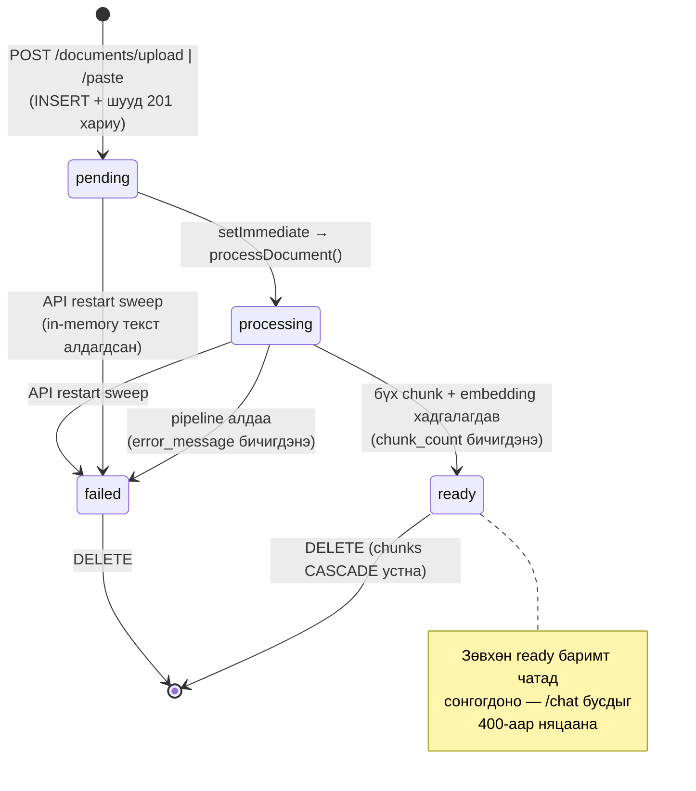
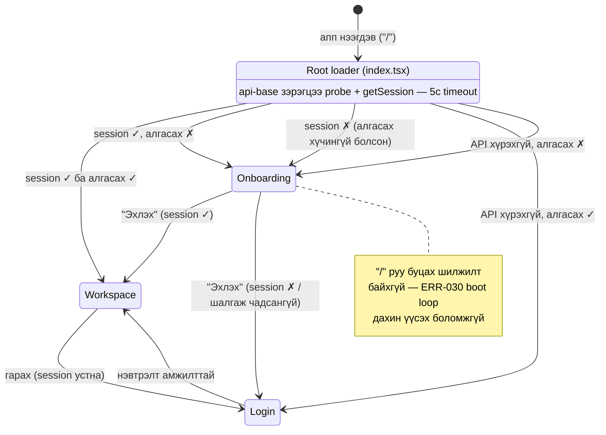

# State Diagrams

## 1. Document lifecycle

Баримтын төлөвийн машин. Код: `apps/api/src/modules/ingestion/pipeline.ts` (`updateDocumentStatus`, `setDocumentError`) + startup sweep (`index.ts`). Клиентүүд `pending`/`processing` төлөвтэй баримт байхад л 3с тутам `GET /documents/:id/status`-аар шалгана.

- Schema-ийн CHECK нь түүхэн шалтгаанаар `'error'` утгыг бас зөвшөөрдөг ч код зөвхөн `failed` ашигладаг.
- `failed` төлөвийн шалтгаан `documents.error_message`-д хадгалагдаж хоёр UI-д харагдана (migration 003, ERR-027).

## 2. Mobile routing states

Expo Router-ийн эхлэлийн чиглүүлэлт. Код: `apps/mobile/app/index.tsx` (root loader) + `app/onboarding.tsx`. ERR-030-ийн дараах бодлого: **онбординг алгасах сонголт зөвхөн хүчинтэй session байх үед үйлчилнэ**; Onboarding-оос `/` руу буцах зам байхгүй тул boot loop боломжгүй.

