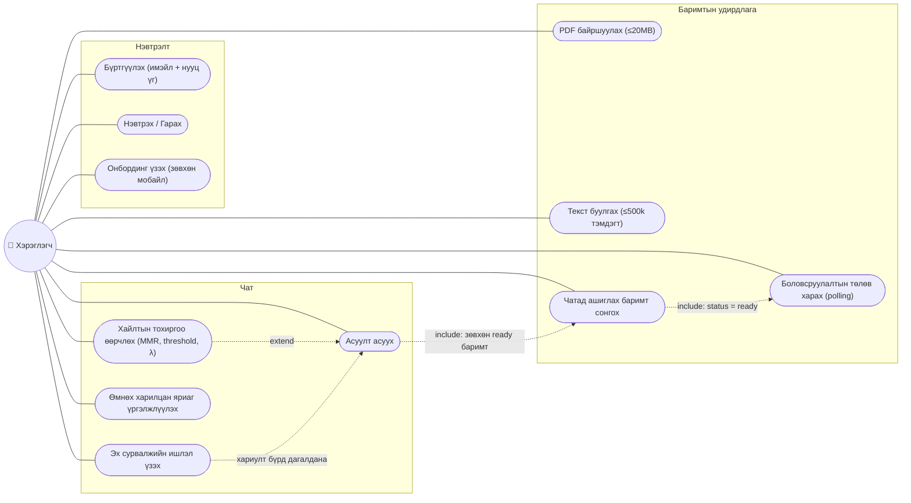
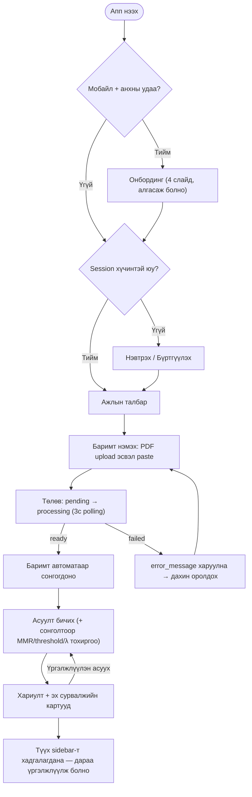

# Use Case / User Flow Diagram

Хэрэглэгчийн бүх үндсэн үйлдэл ба тэдгээрийн урьдчилсан нөхцөлүүд. Вэб болон мобайл клиент ижил use case-уудыг дэмжинэ (онбординг зөвхөн мобайлд).

## Use cases

## Үндсэн урсгал (happy path)

## Тэмдэглэл

- Бүх use case (онбордингоос бусад) нэвтэрсэн байхыг шаардана — `requireUser()` 401 буцаана.
- Баримт `ready` биш бол сонгогдохгүй; `/chat` нь ready биш баримттай хүсэлтийг 400-аар няцаана.
- Хайлтын тохиргооны анхдагч утгууд: `useMMR=true`, `threshold=0.1`, `lambda=0.5` (ERR-021 interim).
